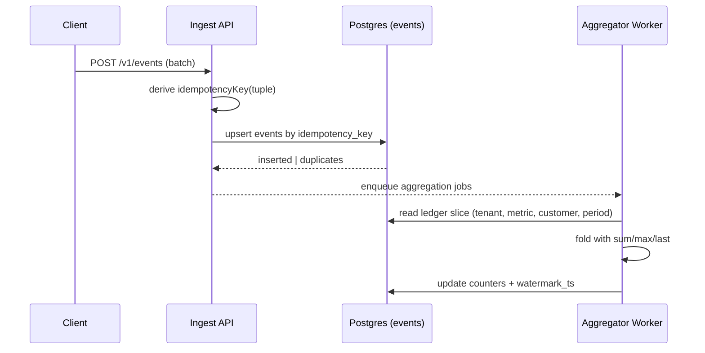
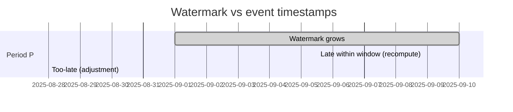
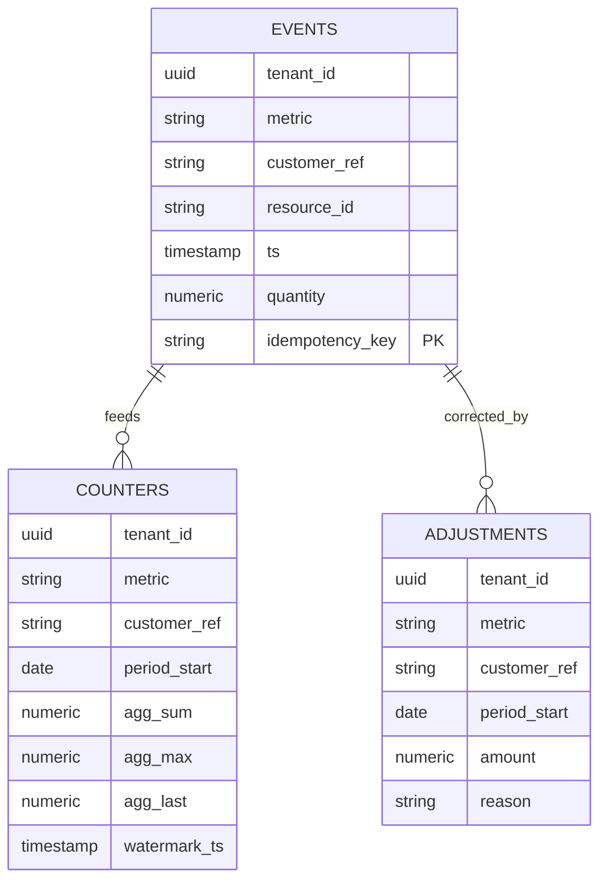

### ADR: Idempotency, Ordering, and Watermarks for Event Ingestion

Date: 2025-09-10

#### Context

Usage metering must tolerate duplicates, retries, and out-of-order delivery while remaining simple to reason about and correct. We ingest events from many producers with varying retry semantics and clocks. We need deterministic deduplication, clear lateness behavior, and order-insensitive aggregation.

#### Decision

- **Immutable ledger with deterministic idempotency key**
  - Every ingested event is persisted in an append-only `events` table. The primary key is a deterministic `idempotencyKey` derived from a tuple of business identifiers.
  - Canonical key tuple used for the ledger and ordering is the event identity: `(tenantId, metric, customerRef, resourceId?, ts)`.
    - For simplicity when reasoning about ordering we refer to the base ordering key as `(tenantId, metric, ts)`. Uniqueness is extended by `customerRef` and optional `resourceId` so that independent customer/resource streams cannot collide.
  - We generate an idempotency key when one is not provided by the client using a stable hash of the tuple. Duplicate inserts naturally conflict on the primary key and are treated as no-ops (reported as duplicates to the caller).

- **Out-of-order tolerance via recomputation and watermarks**
  - Aggregations are computed from the ledger into `counters` per `(tenantId, metric, customerRef, period)` using order-insensitive math (`sum`, `max`, `last`).
  - A per-key watermark `watermark_ts` is maintained representing the maximum event `ts` that has been folded into the counter.
  - A configurable lateness window `L` (default 48h; 24–72h typical) governs how late events are handled:
    - If an event arrives with `ts ∈ [watermark_ts - L, +∞)` and belongs to the counter’s period, we recompute the counter from the ledger slice and advance the watermark as appropriate.
    - If `ts < watermark_ts - L` but still within the target period, we do not shift historical watermarks. Instead we record an explicit adjustment targeting that period.

- **Future timestamps**
  - Events more than a small bound in the future are rejected (default 1h) to defend against clock skew and erroneous producers while allowing benign skews.

#### Semantics

- **Event identity**
  - Tuple: `(tenantId, metric, customerRef, resourceId?, ts)`
  - Generated key example: `idempotencyKey = base64url(HMAC(salt, JSON.stringify(tuple)))`
  - Properties:
    - Stable across retries and transports
    - Infinite deduplication horizon at the ledger (no TTL)
    - Collision domain scoped by business identifiers, not transport concerns

- **Deduplication**
  - Ledger-level dedup is enforced by the primary key on `events.idempotency_key`. Conflicts are expected and cheap.
  - Client-provided `idempotencyKey` is honored when present; otherwise we derive it server-side with the same tuple to keep semantics consistent.

- **Ordering**
  - Aggregation is defined as a pure fold over the ledger slice for a period. Because we recompute from source-of-truth rows, ingestion order does not affect correctness.

- **Watermark and lateness**
  - `watermark_ts(tenant, metric, customer, period)` = max event `ts` folded to date.
  - Lateness window `L` is configured per metric (global default exists). Late-but-within-window events trigger recomputation; beyond the window we produce explicit adjustments rather than reopening history.
  - Advancing rule: watermark only moves forward, except during recomputation triggered by late-within-window events where it may remain unchanged if the max `ts` does not change.

#### Why not alternatives

- **Stateless dedup (e.g., in-memory/TTL cache of seen keys)**
  - Rejected: a TTL implies a finite dedup horizon and risks replays after expiry. It also fails across process restarts and does not provide an audit trail.

- **Per-producer sequence numbers and strictly ordered delivery**
  - Rejected: requires tight coordination and state on producers; does not handle multi-producer fan-in. Adds coupling without improving end-state correctness since we recompute from an immutable ledger.

- **Transport-level exactly-once (e.g., Kafka EOS)**
  - Rejected for ingestion: adds infra complexity while our DB primary key already provides exactly-once semantics at the business-object level. We retain at-least-once delivery and achieve exactly-once effects via idempotency at the sink.

#### Implementation Notes

- Schema: `packages/database/src/schema/events.ts` defines `events` with primary key `idempotency_key` and indexes for `(tenantId, metric, customerRef, ts)`.
- Ingest API: `apps/api/src/routes/events.ts` validates input, derives `idempotencyKey` via `@stripemeter/core` `generateIdempotencyKey`, enforces a max-future bound (~1h), and upserts the batch (reporting duplicates).
- Aggregation: `apps/workers/src/workers/aggregator.ts` folds events into `counters` and maintains watermarks; metrics choose `sum`/`max`/`last` aggregation.
- Backfills and corrections are appended as events or adjustments; we never delete or mutate ledger rows.

#### Operational Defaults

- Lateness window `L`: 48 hours (override per metric as needed)
- Future skew tolerance: 1 hour (reject beyond)
- Timezone: UTC for event `ts`, period boundaries, and counters

#### Consequences

- Duplicates are cheap and harmless; out-of-order events within `L` self-heal via recomputation.
- Very late events do not silently corrupt history; they create explicit adjustments that are visible and auditable.
- All decisions are explainable from the immutable ledger, enabling trustworthy reconciliation and replay.

#### Diagrams

