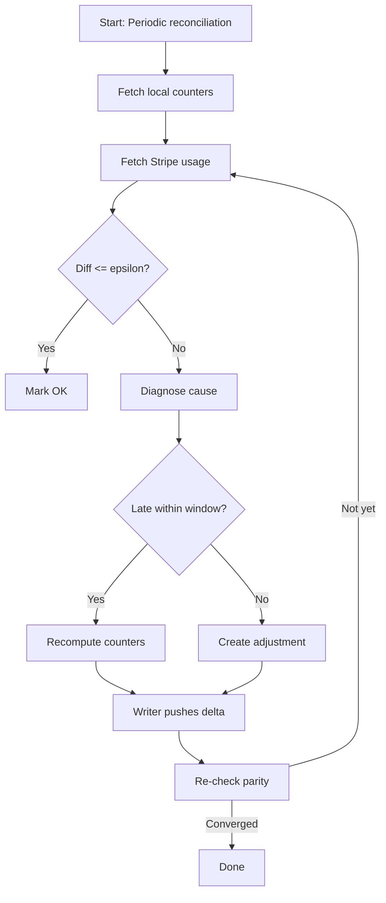
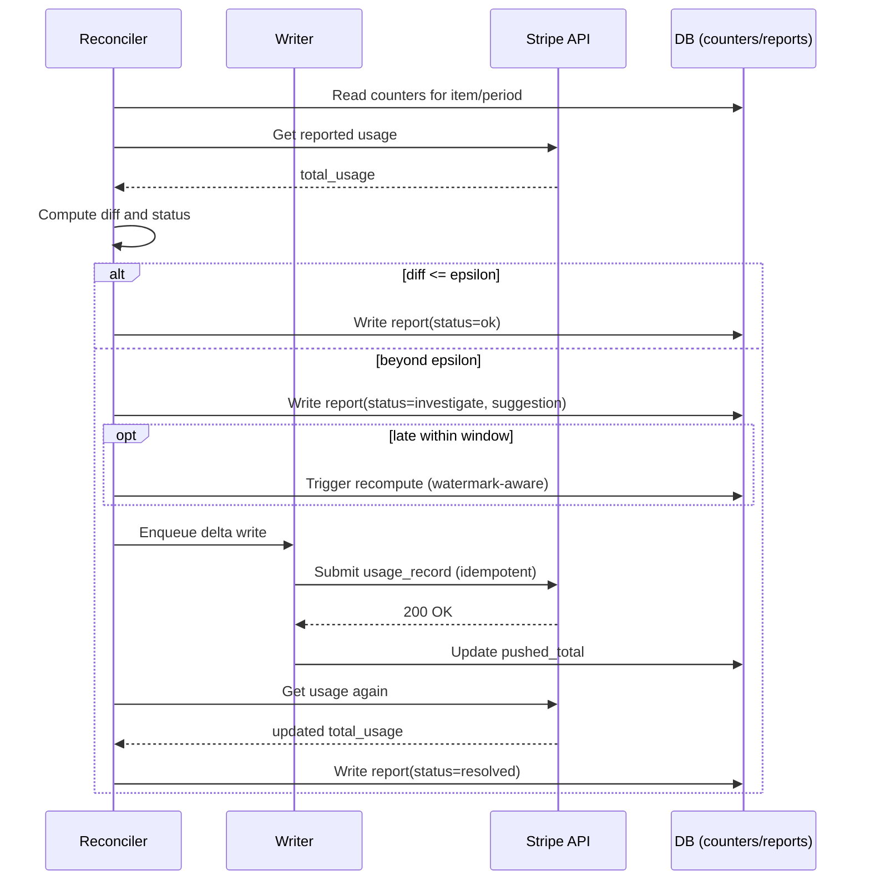

### ADR: Reconciliation & Invoice Parity

Date: 2025-09-10

#### Context

Metered billing must keep Stripe’s reported usage and our local counters in lock-step before invoices finalize. Producers may send late or duplicate events; our writer may be rate-limited; Stripe usage reporting is eventually consistent. We need a principled invariant and a correction loop that ensures invoices finalize at parity without manual firefighting.

#### Decision

- **Parity invariant (open periods):** For every mapped `(tenantId, metric) → (subscription_item)` and period `P`, the Stripe-reported quantity equals our local aggregated total within a small epsilon while the invoice is open.
- **Parity invariant (finalized invoices):** For any finalized invoice covering period `P`, Stripe quantity must equal our local total exactly (0% diff) because corrections were applied before finalization. Post-finalization discrepancies are handled by credit notes or next-invoice adjustments, not by retroactive usage edits.

- **Correction loop (before finalization):**
  1) Periodic comparison: For each mapping and current/previous open period, compute `local_total` from `counters` and `stripe_total` from Stripe.
  2) Diff evaluation: If `|local_total - stripe_total| <= epsilon`, mark as `ok`; otherwise `investigate`.
  3) Diagnose cause: late events within lateness window → trigger re-aggregation; beyond window → propose explicit `adjustments` against the period.
  4) Apply corrections: Writer pushes the delta so that `stripe_total` converges to `local_total` before the invoice closes.

- **Timing & Stripe limits:**
  - Adjustments must be pushed before the invoice is finalized by Stripe. Stripe’s usage records have backdating constraints; practically, providers should submit usage as it happens and no later than 24 hours after the end of the billing period. After an invoice is finalized, usage changes do not retroactively alter it.

#### Semantics

- **Epsilon policy:** `RECONCILIATION_EPSILON` defines allowable drift on open periods (default 0.5%). We target 0% upon finalization.
- **Late events & watermarks:** Within the lateness window `L`, recomputation brings local totals up; writer delta then aligns Stripe. Beyond `L`, create explicit `adjustments` so both sides converge.
- **Writer delta model:** `delta = local_total - pushed_total` per `(subscription_item, customer?, period)`. Only positive deltas are sent; on success we set `pushed_total = local_total` and record the idempotency token to make retries safe.

#### Implementation Notes

- Reconciler: `apps/workers/src/workers/reconciler.ts`
  - Compares local `counters` vs Stripe usage per mapping and period.
  - Emits `reconciliation_reports` with `status: 'ok' | 'investigate' | 'resolved'` and suggested `adjustments` where applicable.
  - Uses `getCurrentPeriod` and `RECONCILIATION_EPSILON` from `@stripemeter/core`.

- Writer: `apps/workers/src/workers/stripe-writer.ts`
  - Computes per-item deltas and submits Stripe usage records using idempotent request IDs.
  - Observes Stripe rate limits via per-account concurrency control and backs off on 429/5xx.

- Data model: `packages/database`
  - `counters` hold aggregated totals by `(tenantId, metric, customerRef, periodStart)` with watermarks.
  - `price_mappings` map `(tenantId, metric)` to Stripe `(subscription_item)`.
  - `reconciliation_reports` store diff snapshots and recommendations.
  - `adjustments` represent explicit corrections when lateness exceeds window or manual fixes are needed.

- Operational flow:
  - Reconciler runs on a cadence (default hourly) across current and any still-open previous periods.
  - For items beyond epsilon, propose or auto-apply corrections depending on policy. Ensure convergence before Stripe finalizes the invoice.

#### Alternatives Considered

- **Reconcile only after finalization:** Rejected; requires credit notes and customer-impacting remediations. Pre-finalization corrections are cheaper and cleaner.
- **Always auto-adjust regardless of lateness window:** Rejected; we prefer recomputation for correctness and auditability when the event falls within the policy window.
- **Push exact totals on every event:** Rejected; leads to excessive Stripe write amplification and rate limits. Delta model with batching is more robust.

#### Operational Defaults

- Reconciliation interval: 1h
- Epsilon: 0.5% diff on open periods; 0% at finalization
- Lateness window: 48h (aligns with Idempotency & Ordering ADR)
- Stripe backdating guidance: submit usage continuously; do not rely on windows > 24h or post-finalization edits

#### Consequences

- Our system converges Stripe to local truth continuously; invoices close at parity.
- Drifts are explained and auditable via `reconciliation_reports` and `adjustments`.
- Rate limits are respected; retries are safe due to idempotency.

#### Diagrams

