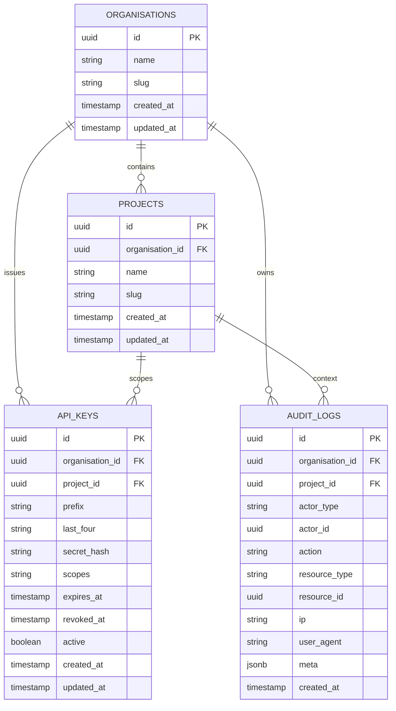
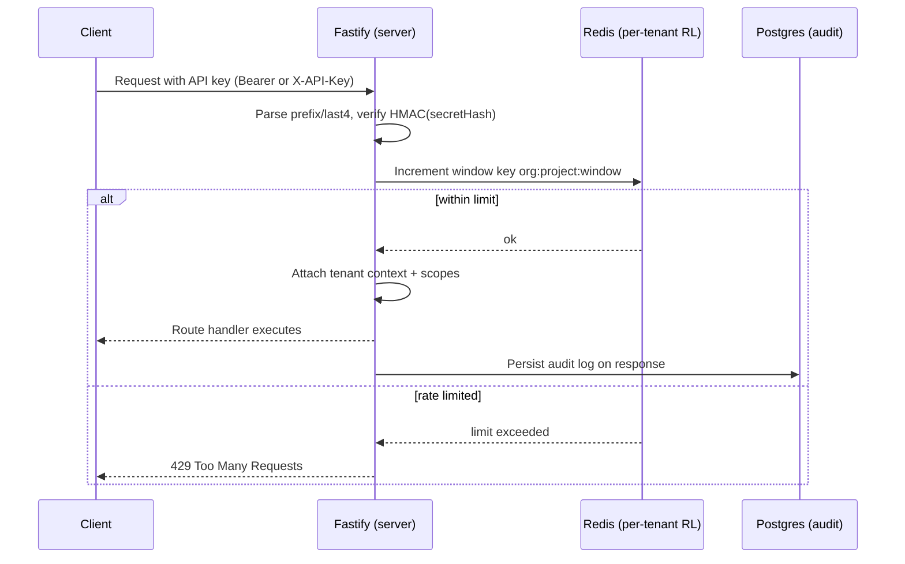
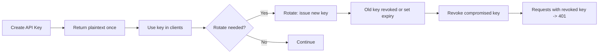

### ADR: Tenancy, Authentication, RBAC, Rate Limiting, and Audit Logging

Date: 2025-09-10

#### Context

Stripemeter serves multiple organisations. We need API-key based access for service integrations, clear scoping to org/project, simple RBAC, per-tenant rate limiting to prevent noisy neighbors, and an audit trail. Security must be easy to operate (rotate/revoke) and safe by default.

#### Decision

- **Org/Project model**
  - `organisations(id, name, slug, createdAt, updatedAt)`
  - `projects(id, organisationId, name, slug, createdAt, updatedAt)`
  - Tenancy columns are explicit across domain tables as `tenantId` or `organisationId` and optional `projectId` where relevant.

- **API key format & storage**
  - Format presented to clients: `<prefix>.<secret>` (e.g., `sm_ab12cd.XYZ...`).
  - Server stores only: `prefix`, `lastFour(secret)`, and `secretHash = HMAC-SHA256(API_KEY_SALT, apiKey)`.
  - Keys carry metadata: `organisationId`, optional `projectId`, `name`, `scopes`, `expiresAt?`, `revokedAt?`, `active`.
  - Verification: lookup candidates by `(prefix, lastFour)`, compute HMAC, constant-time compare with stored `secretHash`.

- **RBAC & scopes**
  - Org-level roles: `owner`, `maintainer`, `viewer` (policy-level; for future user auth).
  - API-key scopes enforce route access initially (e.g., `project:read`, `project:write`).
  - Request context attaches `{ organisationId, projectId?, apiKeyId, apiKeyPrefix, scopes[] }` for downstream checks.

- **Rate limiting**
  - Global Fastify limit for abuse protection.
  - Per-tenant fixed-window limit in Redis keyed by `org:project:window` (defaults: `1000 req / 60s`, configurable via `TENANT_RATE_LIMIT`, `TENANT_RATE_LIMIT_WINDOW`). Requests beyond return 429.

- **Audit logging**
  - Persist an audit record for authenticated requests (excluding `/health` and `/docs`): `organisationId`, `projectId?`, `actorType='api_key'`, `actorId`, `action=METHOD path`, `ip`, `userAgent`, `meta{requestId,statusCode,path}`.
  - Stored in Postgres. Consider WORM/immutable storage in future for stronger tamper evidence.

- **Admin endpoints**
  - Create key: `POST /v1/admin/api-keys` (returns plaintext once)
  - Rotate key: `POST /v1/admin/api-keys/:id/rotate`
  - Revoke key: `POST /v1/admin/api-keys/:id/revoke`

#### Implementation Notes

- Auth: `apps/api/src/utils/auth.ts` (API key parsing, HMAC verification, tenant context attach)
- Rate limiting: global via Fastify plugin; per-tenant in `apps/api/src/utils/rate-limit.ts`
- Audit: `apps/api/src/utils/audit.ts` (hook on response)
- Admin routes: `apps/api/src/routes/admin.ts` (generate/rotate/revoke)
- Schema: `packages/database/src/schema/api-keys.ts`, `audit-logs.ts`, `projects.ts`

#### Security Assumptions & Boundaries

- `API_KEY_SALT` is secret and rotated via key rollovers; leaked salt does not compromise existing keys if roll handled properly (rotate keys and change salt).
- We do not store API-key secrets; support and logs may reference prefix/last-4 only.
- Scopes are enforced server-side; keys may be constrained to a project.
- BYPASS mode (`BYPASS_AUTH=1`) exists for tests and must never be enabled in production.
- Rate limit keys are per tenant/project; noisy neighbor isolation depends on accurate tenant resolution.

#### Alternatives Considered

- JWT for service-to-service auth: rejected for now; API keys provide simpler lifecycle and operational model.
- Storing bcrypt/argon2 of secrets: rejected; HMAC with server-side secret achieves required security properties without slow KDF costs.
- Global-only rate limiting: rejected; does not protect other tenants from a single tenant’s traffic spikes.

#### Operational Defaults

- Tenant limit: 1000 req / 60s (override via env)
- Key prefix namespace: `sm_` by default
- Key length: 24 bytes base64url secret; last-4 displayed for support

#### Consequences

- Clear multi-tenant isolation across auth, rate limiting, and auditing.
- Easy rotation/revocation without ever storing plaintext secrets.
- Predictable failure modes (401/403/429) and actionable audit trail.

#### Diagrams

